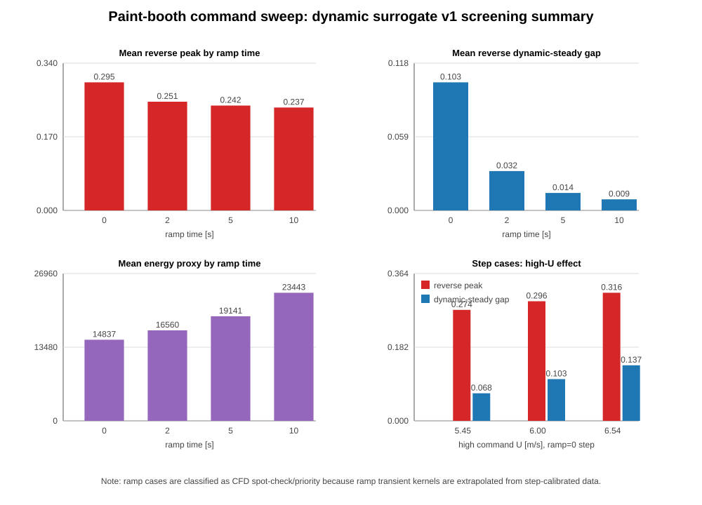

# Paint-booth dynamic surrogate command-scenario sweep

## Objective

Classify blower command scenarios before launching additional transient CFD. The practical question is not only "which command pattern is good?" but also:

```text
When is the steady CFD library enough?
When is the dynamic surrogate correction needed?
When should a scenario be promoted to additional transient CFD?
```

This sweep uses the calibrated metric-level dynamic surrogate v1 as a screening tool over low/high blower cycling scenarios.

## Why this screening is needed

The steady library is memoryless:

```text
y(t) ~= y_steady(U_supply(t))
```

This can be adequate for slow commands, long holds, or mean-flow metrics. However, the high-resolution transient CFD showed that near-car reverse fraction is history-dependent:

```text
same current U_supply
!= same wake/reverse state
```

Therefore, command scenarios must be classified by their dynamic risk and by whether they remain inside the surrogate calibration envelope.

## Scripts added

```text
scripts/generate_paint_booth_command_sweep.py
scripts/evaluate_paint_booth_command_sweep.py
```

Generator responsibilities:

```text
- create multi-cycle low/high command histories
- support step and linear ramp transitions
- preserve the project convention that the switch time sample remains pre-change
- write scenario_manifest.json
```

Evaluator responsibilities:

```text
- run scripts/simulate_paint_booth_dynamic_metrics.py for every scenario
- compute steady-only predictions for the same command history
- calculate dynamic-vs-steady gaps
- calculate threshold/risk/energy proxy metrics
- classify each scenario into screening tiers
```

## Important v1 surrogate update

The reverse-fraction impulse kernel was calibrated on the paired high-resolution step size:

```text
4.36 <-> 5.45 m/s
Delta U = 1.09 m/s
```

For ramp commands, applying the full impulse at every small ramp increment would over-count wake impulses. The simulator was updated to scale each reverse impulse by command increment magnitude:

```text
impulse_scale = |Delta U_command| / 1.09
r_pred = r_base + impulse_scale * sum_i a_i exp(-t_since_step / tau_i)
```

This leaves the original 1.09 m/s validation steps unchanged while making ramp screening more reasonable. Ramp predictions are still treated as extrapolations because the kernel was trained on steps, not ramp CFD.

## Sweep design

Generated folder:

```text
cases/paint_booth_l2_dynamic_metric_surrogate_v1_command_sweep/
```

Inputs:

```text
low_u = 4.36 m/s
high_u = 5.45, 6.00, 6.54 m/s
hold_time = 5, 10, 15, 30 s
ramp_time = 0, 2, 5, 10 s
cycles = 3
dt = 0.25 s
```

Total scenarios:

```text
3 high levels * 4 hold times * 4 ramp times = 48 scenarios
```

Generated outputs:

```text
scenarios/*.csv
predictions/*_pred.csv
predictions/*_pred_summary.json
scenario_manifest.json
scenario_summary.csv
scenario_summary.json
sweep_report.json
```

These are generated artifacts under `cases/` and are not intended for Git tracking.

## Screening metrics

The evaluator computes:

```text
reverse_peak
reverse_min
reverse_excess_integral_above_low_baseline
max_dynamic_minus_steady_reverse
max_dynamic_minus_steady_work_zone_Uz
max_dynamic_minus_steady_near_car_Uz
weak_work_downdraft_duration_below_0p20_s
weak_work_downdraft_duration_below_0p22_s
weak_work_downdraft_duration_below_0p24_s
weak_work_downdraft_duration_below_0p25_s
weak_work_downdraft_integral_below_0p24
u_integral_proxy
u3_energy_proxy
```

Interpretation:

```text
reverse_peak:
  maximum near-car reverse fraction over the command scenario

max_dynamic_minus_steady_reverse:
  how much the dynamic wake/reverse prediction deviates from memoryless steady-library prediction

weak_work_downdraft_duration_below_0p24_s:
  time where |work_zone_Uz_mean| < 0.24 m/s

u3_energy_proxy:
  simple fan-energy proxy, proportional to integral U_supply^3 dt
```

## Classification rule

Current rule of thumb:

```text
steady_library_candidate:
  dynamic-steady gap small and command varies slowly enough

dynamic_surrogate_needed:
  dynamic-steady gap is material, but scenario stays in the calibrated high-U range and is step-like

transient_cfd_priority:
  scenario has high dynamic risk, uses high-U extrapolation, or uses ramp commands not yet validated by CFD
```

The evaluator intentionally classifies ramp scenarios conservatively as CFD spot-check candidates because the present transient calibration is step-based.

## Tier counts

```text
dynamic_surrogate_needed: 4
transient_cfd_priority: 44
steady_library_candidate: 0
```

This does not mean every `transient_cfd_priority` case should be run with CFD. It means the screening found no scenario in this small, relatively aggressive cycling set where steady-only was clearly sufficient.

## Main finding 1: step cases show increasing reverse risk with high command level

For `ramp = 0` step scenarios, the largest near-car reverse peaks occur for the highest upper flow:

```text
high_u = 6.54 m/s:
  hold 5 s:  reverse_peak = 0.3270, dynamic-steady reverse gap = 0.1434
  hold 10 s: reverse_peak = 0.3152, dynamic-steady reverse gap = 0.1375
  hold 15 s: reverse_peak = 0.3124, dynamic-steady reverse gap = 0.1349
  hold 30 s: reverse_peak = 0.3113, dynamic-steady reverse gap = 0.1335

high_u = 6.00 m/s:
  hold 5 s:  reverse_peak = 0.3035, dynamic-steady reverse gap = 0.1077
  hold 10 s: reverse_peak = 0.2946, dynamic-steady reverse gap = 0.1032
  hold 15 s: reverse_peak = 0.2925, dynamic-steady reverse gap = 0.1013
  hold 30 s: reverse_peak = 0.2916, dynamic-steady reverse gap = 0.1002

high_u = 5.45 m/s:
  hold 5 s:  reverse_peak = 0.2796, dynamic-steady reverse gap = 0.0713
  hold 10 s: reverse_peak = 0.2735, dynamic-steady reverse gap = 0.0683
  hold 15 s: reverse_peak = 0.2720, dynamic-steady reverse gap = 0.0669
  hold 30 s: reverse_peak = 0.2714, dynamic-steady reverse gap = 0.0661
```

Interpretation:

```text
Higher high-flow commands improve downdraft level but increase dynamic reverse/wake correction after command changes. The dynamic correction is not negligible, especially for 6.00 and 6.54 m/s extrapolation cases.
```

## Main finding 2: ramp commands reduce reverse peaks in the v1 screening model

Aggregate by ramp time:

```text
ramp 0 s:
  mean_reverse_peak = 0.2954
  mean_reverse_excess_integral = 0.2430
  mean_dynamic_steady_reverse_gap = 0.1029
  mean_u3_energy_proxy = 14837.0

ramp 2 s:
  mean_reverse_peak = 0.2507
  mean_reverse_excess_integral = 0.2188
  mean_dynamic_steady_reverse_gap = 0.0316
  mean_u3_energy_proxy = 16559.6

ramp 5 s:
  mean_reverse_peak = 0.2418
  mean_reverse_excess_integral = 0.1292
  mean_dynamic_steady_reverse_gap = 0.0140
  mean_u3_energy_proxy = 19140.5

ramp 10 s:
  mean_reverse_peak = 0.2372
  mean_reverse_excess_integral = 0.0414
  mean_dynamic_steady_reverse_gap = 0.0089
  mean_u3_energy_proxy = 23443.2
```

Interpretation:

```text
In the dynamic surrogate, smoother command changes reduce reverse-fraction spikes and reduce dynamic-vs-steady discrepancy.
```

However, ramp commands also keep the system in transition longer and increase the U^3 energy proxy for the fixed three-cycle scenario. More importantly, ramp cases are extrapolations from step-calibrated dynamics. At least one ramp CFD case should be run before relying on this trend quantitatively.

## Main finding 3: hold time has weaker effect than ramp time in this scenario family

Aggregate by hold time:

```text
hold 5 s:
  mean_reverse_peak = 0.2593
  mean_reverse_excess_integral = 0.1617
  mean_u3_energy_proxy = 8603.7

hold 10 s:
  mean_reverse_peak = 0.2559
  mean_reverse_excess_integral = 0.1573
  mean_u3_energy_proxy = 13549.4

hold 15 s:
  mean_reverse_peak = 0.2551
  mean_reverse_excess_integral = 0.1563
  mean_u3_energy_proxy = 18495.1

hold 30 s:
  mean_reverse_peak = 0.2547
  mean_reverse_excess_integral = 0.1570
  mean_u3_energy_proxy = 33332.0
```

Interpretation:

```text
For this repeated low/high cycling setup, increasing hold time reduces reverse peak only modestly. Ramp shaping has a stronger effect on peak reverse risk than simply holding longer.
```

The energy proxy increases with hold time because the scenario contains longer total high-flow operation.

## Pareto-style candidates

A simple Pareto screen was computed using:

```text
minimize u3_energy_proxy
minimize reverse_peak
minimize weak_work_downdraft_duration_below_0p24_s
```

Representative non-dominated candidates:

```text
u4p36_u5p45_hold5s_ramp0s_cyc3:
  energy = 4085.8
  reverse_peak = 0.2796
  weak024_duration = 20.8 s
  tier = dynamic_surrogate_needed

u4p36_u5p45_hold5s_ramp2s_cyc3:
  energy = 5520.0
  reverse_peak = 0.2473
  weak024_duration = 29.0 s
  tier = transient_cfd_priority

u4p36_u5p45_hold5s_ramp5s_cyc3:
  energy = 7670.0
  reverse_peak = 0.2386
  weak024_duration = 42.5 s
  tier = transient_cfd_priority

u4p36_u6p00_hold5s_ramp5s_cyc3:
  energy = 9172.4
  reverse_peak = 0.2418
  weak024_duration = 35.0 s
  tier = transient_cfd_priority

u4p36_u6p54_hold5s_ramp5s_cyc3:
  energy = 10905.1
  reverse_peak = 0.2450
  weak024_duration = 32.0 s
  tier = transient_cfd_priority
```

Interpretation:

```text
- Pure low-energy operation favors short 5.45 m/s step cycles.
- Reverse-risk reduction favors ramp shaping.
- Stronger high-U commands can reduce weak-downdraft time, but they are outside the paired 4.36 <-> 5.45 transient calibration and should be CFD-checked.
```

## Figure

```text
docs/figures/26-05-03_paint_booth_dynamic_surrogate_command_sweep_summary.svg
```



## Scenario classification conclusions

### Steady-library only

No scenarios in this aggressive sweep were classified as clearly steady-only. This is expected because the sweep focused on repeated command changes rather than slow ramps or long steady operation.

Good future steady-only tests would be:

```text
- 60 s or 120 s ramp
- several-minute hold cases
- small changes such as 4.36 -> 4.91 m/s
```

### Dynamic surrogate needed

The calibrated step family `4.36 <-> 5.45 m/s` with `ramp = 0` is currently the best use case for the v1 dynamic surrogate:

```text
u4p36_u5p45_hold5s_ramp0s_cyc3
u4p36_u5p45_hold10s_ramp0s_cyc3
u4p36_u5p45_hold15s_ramp0s_cyc3
u4p36_u5p45_hold30s_ramp0s_cyc3
```

These remain inside the high-resolution paired transient calibration range and show meaningful dynamic-vs-steady differences.

### Transient CFD priority / spot-check candidates

Recommended next CFD candidates:

```text
1. 4.36 -> 6.54 -> 4.36 step cycle
   Reason: largest dynamic-steady reverse gap and highest reverse peak among step cases.

2. 4.36 -> 6.00 -> 4.36 step cycle
   Reason: intermediate high-U extrapolation, less extreme than 6.54 but still high dynamic risk.

3. 4.36 <-> 5.45 with 2 s or 5 s ramp
   Reason: ramp appears beneficial in surrogate, but no ramp CFD exists yet.

4. Short cycling 4.36 <-> 5.45, hold 5 s
   Reason: inside calibration range and useful for testing reverse-memory accumulation.
```

## Caveats

```text
- v1 is metric-level, not full-field.
- Reverse impulse kernels are empirical.
- Ramp predictions are extrapolated from step response.
- 6.00 and 6.54 m/s command transitions exceed the paired 4.36 <-> 5.45 transient calibration range.
- Energy proxy uses U^3 and is only a relative screening metric, not calibrated fan power.
```

## Recommended next step

Run one additional transient CFD spot check rather than expanding the sweep immediately.

Best next CFD choice:

```text
4.36 -> 6.00 -> 4.36 step-cycle high-resolution transient
```

Why not jump directly to 6.54?

```text
6.54 is the strongest extrapolation and has the highest predicted reverse risk, but 6.00 is a safer intermediate validation point. If the v1 dynamic correction scales reasonably at 6.00, then 6.54 becomes a more justified follow-up.
```

Alternative if the research question prioritizes command smoothing:

```text
4.36 <-> 5.45 with 5 s ramp
```

This would directly test whether the surrogate-predicted reverse-spike reduction under ramping is physically credible.
