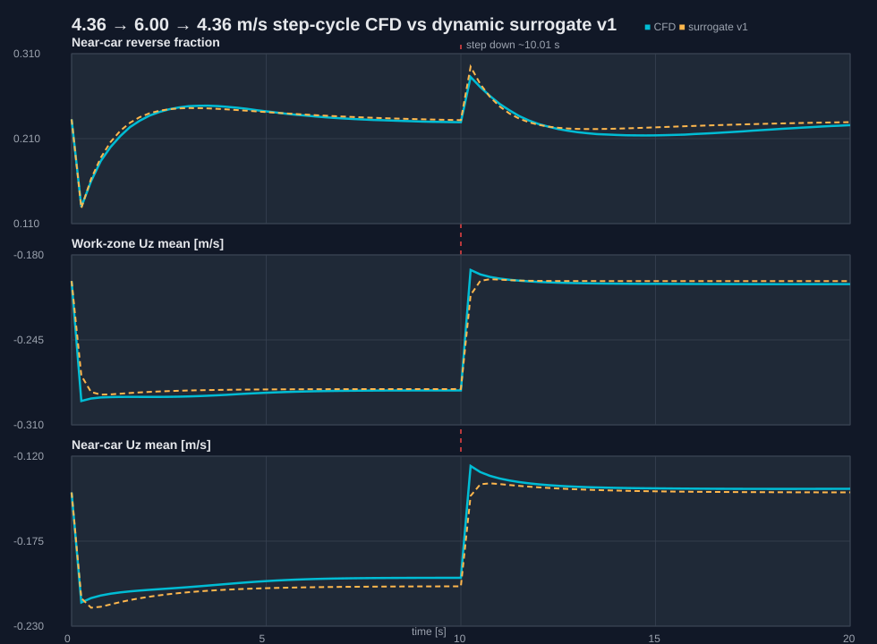

# Paint-booth transient CFD: 4.36 → 6.00 → 4.36 m/s step-cycle validation

## Objective

This run is a targeted transient CFD spot-check selected from the dynamic-surrogate command sweep.
The command sweep indicated that aggressive step cycling to `U_supply = 6.00 m/s` has a larger dynamic reverse-flow gap than the calibrated `4.36 ↔ 5.45 m/s` steps, but is less extreme than the `6.54 m/s` cases.

The goal is therefore to validate whether the v1 metric-level dynamic surrogate, including the `|Delta U| / 1.09` reverse-impulse scaling, remains useful for a larger command step:

```text
4.36 m/s steady initial field
→ 6.00 m/s step-up at t = 0
→ 4.36 m/s step-down at t ≈ 10.01 s
endTime = 20 s
writeInterval = 0.25 s
```

## Case setup

- Case directory:
  ```text
  cases/paint_booth_l2_transient_step_poc/u4p36_to_u6p00_to_u4p36_20s_hi_res_parallel
  ```
- Source steady case:
  ```text
  cases/paint_booth_l2_u_sweep_v0/l2_flow_qa_u4p36
  ```
- Solver: `pimpleFoam`
- Initial field: copied `4.36 m/s` steady result
- End time: `20 s`
- Write interval: `0.25 s`
- Time step control:
  ```text
  deltaT = 0.02 s
  adjustTimeStep = yes
  maxCo = 1.0
  ```
- Parallel execution: 4 MPI ranks
- Decomposition:
  ```foam
  numberOfSubdomains 4;
  method hierarchical;
  hierarchicalCoeffs
  {
      n     (2 2 1);
      delta 0.001;
      order xyz;
  }
  ```

## Boundary command

The supply inlet was changed from a single fixed value to an OpenFOAM table:

```foam
supplyInlet
{
    type            uniformFixedValue;
    uniformValue    table
    (
        (0          (0 0 -6.0))
        (10         (0 0 -6.0))
        (10.01      (0 0 -4.36))
        (20         (0 0 -4.36))
    );
}
```

Important interpretation:

- The internal `t = 0` field is still the copied `4.36 m/s` steady field.
- The inlet patch flow reported at `t = 0` already reflects the `6.00 m/s` boundary command.
- For surrogate comparison, the command-history convention used was:
  ```text
  t = 0.00 s: 4.36 m/s initial state
  t = 0.25--10.00 s: 6.00 m/s
  t = 10.25--20.00 s: 4.36 m/s
  ```

## Execution verification

The full wrapper completed with exit code `0`:

```text
checkMesh -constant
decomposePar -force
mpirun --allow-run-as-root -np 4 pimpleFoam -parallel
reconstructPar
foamToVTK
```

Solver completion:

```text
Time = 20
ExecutionTime = 583.7 s  ClockTime = 584 s
End
Finalising parallel run
```

Reconstruction completed:

```text
No lagrangian fields
No FA fields
End
```

VTK conversion completed:

```text
End: 83.55 s, 354892 kB (peak)
```

VTK time-series output:

```text
n_times = 81
range = 0.00--20.00 s
interval = 0.25 s
```

## CFD time-series postprocessing outputs

Generated files:

```text
cases/paint_booth_l2_transient_step_poc/u4p36_to_u6p00_to_u4p36_20s_hi_res_parallel/post_transient_metrics.csv
cases/paint_booth_l2_transient_step_poc/u4p36_to_u6p00_to_u4p36_20s_hi_res_parallel/post_transient_metrics.json
cases/paint_booth_l2_transient_step_poc/u4p36_to_u6p00_to_u4p36_20s_hi_res_parallel/post_transient_metrics_summary.json
```

Key CFD observations:

- Initial upward step `4.36 → 6.00 m/s` produces a strong immediate downdraft overshoot:
  - `work_zone_Uz_mean` most negative: `-0.2917 m/s` at `t = 0.25 s`
  - `near_car_Uz_mean` most negative: `-0.2147 m/s` at `t = 0.25 s`
- Near-car reverse fraction drops sharply after the upward step, then rebounds:
  - initial: `0.2327`
  - minimum: `0.1297` at `t = 0.25 s`
  - rebound maximum during high-flow phase: `0.2488` at `t = 3.50 s`
- After the step-down to `4.36 m/s`, reverse fraction spikes:
  - peak: `0.2826` at `t = 10.25 s`
- The filter-layer velocity response after step-down is slower than the inlet command:
  - `filter_layer_panel_Uz_mean` t95 from summary: `~11.33 s`
  - i.e. about `1.3 s` after the `10.01 s` command switch.

## Surrogate v1 comparison

Surrogate outputs:

```text
cases/paint_booth_l2_dynamic_metric_surrogate_v1_step_cycle_u4p36_u6p00_u4p36/command_history_u4p36_u6p00_u4p36_20s.csv
cases/paint_booth_l2_dynamic_metric_surrogate_v1_step_cycle_u4p36_u6p00_u4p36/predicted_metrics_u4p36_u6p00_u4p36_20s.csv
cases/paint_booth_l2_dynamic_metric_surrogate_v1_step_cycle_u4p36_u6p00_u4p36/predicted_metrics_u4p36_u6p00_u4p36_20s_summary.json
cases/paint_booth_l2_dynamic_metric_surrogate_v1_step_cycle_u4p36_u6p00_u4p36/analysis_cfd_vs_surrogate_u4p36_u6p00_u4p36_20s.json
```

Comparison figure:

```text
docs/figures/26-05-03_paint_booth_u4p36_u6p00_u4p36_step_cycle_cfd_surrogate.svg
```



Selected RMSE values, excluding the `t = 0` boundary/initial-field convention mismatch:

- `work_zone_Uz_mean`
  - RMSE: `0.00390 m/s`
  - MAE: `0.00262 m/s`
  - max absolute error: `0.01945 m/s`
- `near_car_Uz_mean`
  - RMSE: `0.00454 m/s`
  - MAE: `0.00383 m/s`
  - max absolute error: `0.01937 m/s`
- `near_car_reverse_fraction_Uz_positive`
  - RMSE: `0.00515`
  - MAE: `0.00424`
  - max absolute error: `0.01206`
- `filter_layer_panel_Uz_mean`
  - RMSE: `0.00765 m/s`
  - MAE: `0.00697 m/s`
  - max absolute error: `0.03055 m/s`
- `supply_inflow_m3s`
  - RMSE excluding `t = 0`: `1.74e-6 m3/s`
  - This confirms that the command-history and boundary table are aligned after `t > 0`.

## Relation to command-sweep prediction

The corresponding command-sweep scenario was:

```text
u4p36_u6p00_hold10s_ramp0s_cyc3
```

Sweep-predicted classification:

```text
transient_cfd_priority
```

Sweep-predicted reverse metrics for this aggressive step-cycle family:

```text
reverse_peak ≈ 0.2946
max_dynamic_minus_steady_reverse ≈ 0.1032
```

Current CFD spot-check:

```text
reverse_down_peak = 0.2826 at t = 10.25 s
```

Interpretation:

- The sweep correctly flagged this case as needing transient CFD validation.
- The dynamic surrogate slightly over-predicts the most severe reverse spike, but the error is small enough for screening use.
- The `|Delta U| / 1.09` reverse-impulse scaling is supported for the `4.36 ↔ 6.00 m/s` larger step, at least for metric-level screening.

## Interpretation

This CFD run strengthens the current control-oriented workflow:

1. **Steady library alone is not enough** for aggressive step-cycling cases.
   - The reverse fraction and near-car wake response contain memory/impulse behavior that a steady lookup misses.
2. **The v1 dynamic surrogate is useful as a screening tool** for this larger step.
   - Mean-flow and reverse-fraction errors remain small compared with the dynamic excursion.
3. **Transient CFD should be reserved for selected validation points**, not every command candidate.
   - The sweep → CFD spot-check loop worked as intended here.
4. **Ramp validation remains the next uncertainty.**
   - The current validation covers step scaling from `Delta U = 1.09` to `Delta U = 1.64 m/s`.
   - It does not yet prove that multiple small ramp increments reproduce the same physics.

## Recommended next step

Run one ramped counterpart to validate whether ramp commands actually reduce the reverse spike as predicted by the surrogate sweep:

```text
4.36 → 6.00 → 4.36 m/s
ramp time = 5 s
hold/high-flow window matched as closely as practical
writeInterval = 0.25 s
parallel = 4 ranks
```

Why this is needed:

- The step-cycle CFD validated the larger `Delta U` impulse scaling.
- The remaining extrapolation is the ramp treatment: many small command increments each receive scaled impulse contributions.
- If the ramp CFD confirms lower reverse peak, then command-design recommendations can move from “screening hypothesis” toward “control-strategy guidance.”

If compute time should be minimized, a shorter targeted ramp case can focus on the first `0--15 s` with high-resolution outputs, because the key question is the early reverse spike and settling trend rather than long-time steady behavior.
