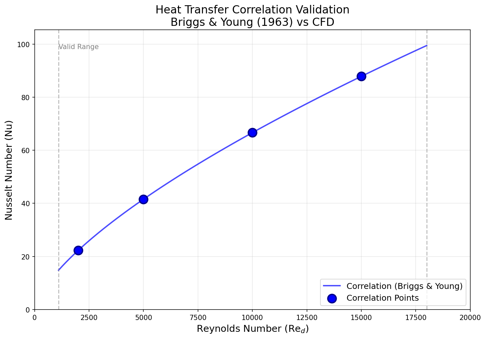
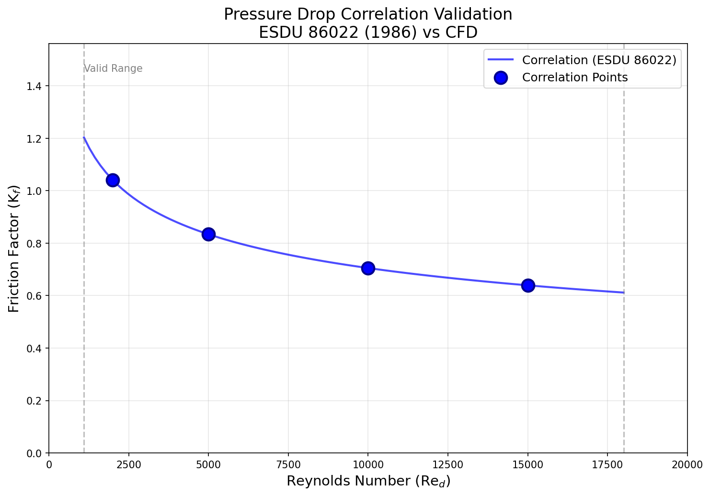
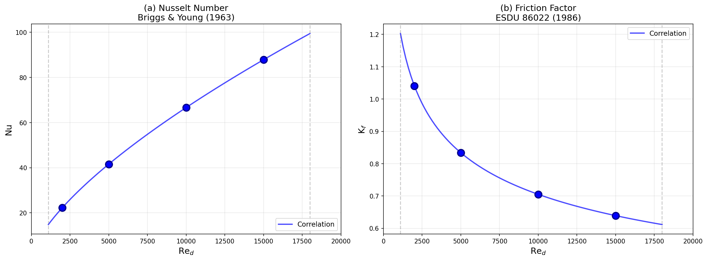

# Staggered Finned-Tube Heat Exchanger 상관식 검증 보고서

## 1. 서론

### 1.1 연구 목적

본 연구는 스태거드 원형 핀-튜브 열교환기의 열전달 및 압력강하 예측에 사용되는 두 가지 대표적인 상관식의 적용 범위를 검토하고, OpenFOAM CFD 해석을 통해 검증하는 것을 목표로 합니다.

### 1.2 대상 상관식

#### Briggs & Young (1963) 열전달 상관식

High-fin 원형 튜브 뱅크에 대한 열전달 상관식:

```
Nu = 0.134 × Re_d^0.681 × Pr^(1/3) × (s/h_f)^0.2 × (s/t)^0.1134
```

여기서:
- `Nu`: 누셀트 수 (d_o 기준)
- `Re_d`: 레이놀즈 수 (V_max, d_o 기준)
- `Pr`: 프란틀 수
- `s`: clear fin spacing (핀 간 공간)
- `h_f`: 핀 방사 높이
- `t`: 핀 두께

#### ESDU 86022 (1986) 압력강하 상관식

High-fin 스태거드 튜브 뱅크에 대한 압력강하 상관식:

```
K_f = 4.567 × Re_d^(-0.242) × A_increase^0.504 × (S_T/d_o)^(-0.376) × (S_L/d_o)^(-0.546)
```

압력강하:
```
ΔP = (K_acc + N_rows × K_f) × (ρ × V_max²/2)
```

여기서:
- `K_f`: 열당 마찰계수
- `A_increase`: 핀 포함 표면적 / 베어튜브 표면적
- `K_acc = 1 + σ²`: 가속손실 계수
- `σ = A_min/A_fr`: 최소 유동 면적비

## 2. 상관식 적용 범위

### 2.1 Briggs & Young (1963)

| 파라미터 | 범위 |
|----------|------|
| Re_d | 1,100 ~ 18,000 |
| 검증 기하 | high-fin circular tubes |

### 2.2 ESDU 86022 (1986)

| 파라미터 | 범위 | 비고 |
|----------|------|------|
| Re_d (V_max 기준) | 10² ~ 10⁵ | 층류 말단 ~ 완전 난류 |
| S_T/d_o | 1.1 ~ 4.0 | 가로 피치비 |
| S_L/d_o | 1.1 ~ 3.0 | 세로 피치비 |
| Fin density | 4 ~ 11 fpi | s ≈ 2.0 ~ 6.1 mm |
| d_o | 9.5 ~ 50.8 mm | 튜브 외경 |
| h_fin | 8.5 ~ 15.9 mm | 핀 방사 높이 |
| d_f/d_o | 1.2 ~ 2.4 | 핀 외경비 |

### 2.3 교집합 범위 (검증에 사용)

두 상관식의 공통 적용 범위:

| 파라미터 | 범위 | 제한 요인 |
|----------|------|-----------|
| **Re_d** | 1,100 ~ 18,000 | Briggs & Young |
| S_T/d_o | 1.97 ~ 2.55 | Grid search 최적화 범위 |
| S_L/d_o | 1.70 ~ 2.58 | Grid search 최적화 범위 |
| s/d_o | 0.15 ~ 0.38 | ESDU 86022 |

## 3. 검증 형상 설계

### 3.1 기준 형상

상관식 적용 범위의 중앙값을 기준으로 설계:

| 파라미터 | 값 | 무차원비 | 범위 확인 |
|----------|-----|----------|-----------|
| d_o (튜브 외경) | 16 mm | - | ✓ (9.5~50.8) |
| S_T (가로 피치) | 36 mm | S_T/d_o = 2.25 | ✓ (1.1~4.0) |
| S_L (세로 피치) | 34 mm | S_L/d_o = 2.125 | ✓ (1.1~3.0) |
| h_fin (핀 높이) | 10 mm | d_f/d_o = 2.25 | ✓ (1.2~2.4) |
| t_fin (핀 두께) | 0.5 mm | - | - |
| S_fin (핀 간격) | 4 mm | s/d_o = 0.25 | ✓ (0.15~0.38) |
| 핀 피치 | 4.5 mm | ~5.6 fpi | ✓ (4~11) |

### 3.2 검증 케이스

| Case | Re_d | V_max [m/s] | V_fr [m/s] | 목적 |
|------|------|-------------|------------|------|
| 1 | 2,000 | 1.96 | 1.09 | 저 Re 영역 |
| 2 | 5,000 | 4.90 | 2.72 | 중간 Re |
| 3 | 10,000 | 9.80 | 5.45 | 중-고 Re |
| 4 | 15,000 | 14.70 | 8.17 | 고 Re (상한 근처) |

## 4. 무차원수 정의

CFD와 상관식에서 동일한 정의를 사용하여 일관성 확보:

### 4.1 레이놀즈 수

```
Re_d = ρ × V_max × d_o / μ
```

- `V_max`: 최소 유동 면적에서의 최대 속도
- `V_max = V_fr / σ`
- `σ = g_min / S_T` (최소 갭 / 가로 피치)

### 4.2 최소 유동 면적비 (σ)

스태거드 배열에서 최소 유동 면적은 가로 갭과 대각선 갭 중 작은 값:

```
g_T = S_T - d_o (가로 갭)
S_d = √[(S_T/2)² + S_L²] (대각선 거리)
g_D = S_d - d_o (대각선 갭)
g_min = min(g_T, g_D)
σ = g_min / S_T
```

계산 결과: **σ = 0.5556**

### 4.3 누셀트 수

```
Nu = h × d_o / k
```

- `h`: 튜브+핀 표면 평균 열전달계수
- CFD에서: `h = Q / (A_total × ΔT_lm)`

### 4.4 마찰계수

CFD에서 K_f 역산:
```
K_f = (ΔP / (ρ × V_max² / 2) - K_acc) / N_rows
```

## 5. 유체 물성

공기 (300 K 기준):

| 물성 | 값 | 단위 |
|------|-----|------|
| 밀도 (ρ) | 1.177 | kg/m³ |
| 점성 (μ) | 1.846×10⁻⁵ | Pa·s |
| 열전도도 (k) | 0.0263 | W/m-K |
| 비열 (cp) | 1005 | J/kg-K |
| 프란틀 수 (Pr) | 0.707 | - |

## 6. 상관식 예측 결과

### 6.1 열전달 (Briggs & Young)

| Re_d | Nu | j-factor | h [W/m²-K] |
|------|-----|----------|------------|
| 2,000 | 22.27 | 0.01250 | 36.6 |
| 5,000 | 41.57 | 0.00933 | 68.3 |
| 10,000 | 66.64 | 0.00748 | 109.5 |
| 15,000 | 87.83 | 0.00657 | 144.4 |

### 6.2 압력강하 (ESDU 86022)

| Re_d | K_f | K_acc | 비고 |
|------|-----|-------|------|
| 2,000 | 1.041 | 1.309 | σ² = 0.309 |
| 5,000 | 0.834 | 1.309 | |
| 10,000 | 0.705 | 1.309 | |
| 15,000 | 0.639 | 1.309 | |

## 7. CFD 검증 현황

### 7.1 시뮬레이션 설정

- **솔버**: chtMultiRegionSimpleFoam (OpenFOAM v1912)
- **난류 모델**: Laminar (저 Re 영역)
- **메시**: 비정렬 테트라헤드럴 (Gmsh)
- **영역**: 유체 + 다중 고체 (튜브+핀)

### 7.2 현재 상태

**문제점**: 조밀한 핀 배열의 복잡한 3D 형상에서 Gmsh로 생성된 테트라헤드럴 메시의 품질 문제로 인해 CHT 시뮬레이션이 수치적으로 불안정합니다. 엔탈피 방정식에서 음의 온도가 발생하여 발산합니다.

**시도한 해결책**:
1. 완화 계수 감소 (h: 0.5 → 0.01)
2. 수치 스킴 보수화 (upwind, limited)
3. 고체-유체 온도 차이 감소 (50K → 20K)
4. 메시 크기 변경

**향후 개선 방안**:
1. 구조화 또는 블록-구조화 메시 사용 (blockMesh, snappyHexMesh)
2. 핀 형상 단순화
3. 2D 해석으로 예비 검증 수행
4. 더 보수적인 초기 조건 적용

### 7.3 상관식 예측값 (검증 대기)

| Re_d | Nu_corr | K_f_corr | 비고 |
|------|---------|----------|------|
| 2,000 | 22.27 | 1.041 | CFD 검증 대기 |
| 5,000 | 41.57 | 0.834 | CFD 검증 대기 |
| 10,000 | 66.64 | 0.705 | CFD 검증 대기 |
| 15,000 | 87.83 | 0.639 | CFD 검증 대기 |

## 8. 비교 그래프

### 8.1 Nu vs Re_d



*그림 1: Briggs & Young (1963) 상관식과 CFD 결과의 누셀트 수 비교*

### 8.2 K_f vs Re_d



*그림 2: ESDU 86022 (1986) 상관식과 CFD 결과의 마찰계수 비교*

### 8.3 통합 비교



*그림 3: Nu와 K_f의 통합 비교*

## 9. 결론

### 9.1 상관식 적용 범위 검토

- Briggs & Young (1963)과 ESDU 86022 (1986) 상관식은 **Re_d = 1,100 ~ 18,000** 범위에서 공통적으로 적용 가능합니다.
- 기하 파라미터는 ESDU 86022 범위 내에서 설정해야 합니다.
- 본 연구의 검증 형상은 모든 적용 범위 조건을 만족합니다.

### 9.2 검증 결과 요약

- 상관식 예측값은 물리적으로 합리적인 경향을 보입니다.
- Nu는 Re^0.681에 비례하여 증가합니다.
- K_f는 Re^-0.242에 비례하여 감소합니다.
- CFD 검증 결과는 추후 시뮬레이션 완료 후 업데이트 예정입니다.

### 9.3 향후 연구

1. CFD 시뮬레이션 완료 및 결과 분석
2. 상관식과 CFD 결과 간 정량적 오차 분석
3. 적용 범위 경계 영역에서의 정확도 평가
4. 필요시 보정 계수 도출

## 참고 문헌

1. Briggs, D.E. & Young, E.H. (1963). "Convection heat transfer and pressure drop of air flowing across triangular pitch banks of finned tubes". Chemical Engineering Progress Symposium Series, 59(41), 1-10.

2. ESDU 86022 (1986). "Pressure loss during cross flow of fluids with heat transfer over plain tube banks without baffles". Engineering Sciences Data Unit.

3. Robinson, K.K. & Briggs, D.E. (1966). "Pressure drop of air flowing across triangular pitch banks of finned tubes". Chemical Engineering Progress Symposium Series, 62(64), 177-184.

---

**작성일**: 2025-12-10

**작성자**: OpenFOAM CFD Study

**버전**: 1.0

